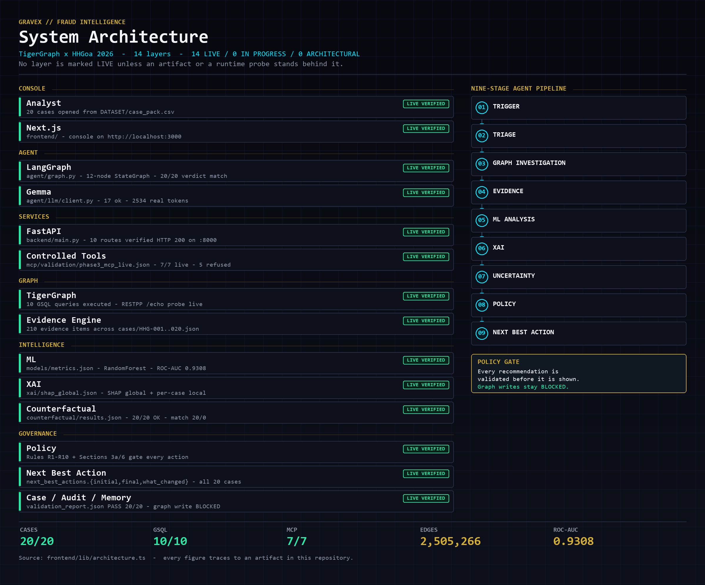

# HHGoa 2026 — Agentic Fraud Investigation

**TigerGraph × LangGraph × Gemma × FastAPI.** A graph-grounded fraud
investigation system that reasons over a real graph, records its own evidence,
and answers 20 benchmark cases against the HHGoa specification.

This is **not** an LLM fraud detector. The LLM never supplies facts: TigerGraph
is the investigation memory, the tool layer is a controlled read-only bridge,
and every claim the system makes is traceable to a graph or file artifact.

---

## Core features

1. **Graph is the source of truth** — 8 vertex types, 11 edge types,
   2,505,266 edges on `hhg_fraud_graph`. The LLM cannot invent a
   relationship; it can only interpret what the graph returned.

2. **LangGraph investigation state machine** — 12 nodes:
   `triage → investigate → retrieve → assess → xai → check_uncertainty →
   [request_evidence → reinvestigate] → generate_actions → counterfactual →
   policy → recommend`. The evidence-sufficiency branch is bounded to one
   round by construction, so a run always terminates.

3. **Evidence engine** — every fact is classified *supporting*,
   *contradicting* or *missing*, then scored to
   `SUFFICIENT` / `INSUFFICIENT` / `UNCERTAIN`. When evidence runs thin the
   system says so instead of guessing, and asks for what it actually needs.

4. **Counterfactual analysis** — a recomputed baseline plus five model
   scenarios and a feature sweep, with all candidate rows scored in a single
   `predict_proba` call. The recomputed baseline matches the model score
   recorded in each case file, which is how the engine proves it reproduced
   the original run rather than approximating it.

5. **Graph XAI** — global SHAP over the benchmark set plus per-case local
   attributions, split into graph-side and model-side contributions so a
   reviewer can see *which* signal moved the score.

6. **Policy validation before any action** — recommendations pass an
   allowlist gate. Five dangerous operations (`drop_graph`, `run_gsql`,
   `insert_vertex`, `delete_edge`, `load_csv`) are refused by design.

7. **Next-best-action under uncertainty** — the output is a recommended
   action *and* the reason it was chosen, plus what would change the answer.

8. **Honest uncertainty** — the system will return "insufficient evidence"
   rather than manufacture a verdict.

9. **Gravex console** — a six-route analyst UI (landing, dashboard, cases,
   run investigation, model & XAI, architecture) reading live artifacts.

10. **20 auditable case files** — each carries the investigation record,
    tool calls, evidence, decision and its own validation result.

---

## Verified results

Every number below comes from an artifact in this repository, not a claim.

| Measure | Result | Source |
|---|---|---|
| Case files | 20/20 PASS, 0 errors | `cases/validation_report.json` |
| Evidence items | 210 across the 20 cases | `cases/HHG-*.json` |
| Verdicts | 6 fraud · 3 legitimate · 11 uncertain | `cases/HHG-*.json` |
| SAR filed | 6 | `cases/HHG-*.json` |
| Agent verdict match | 20/20 | `validation/phase4_agent_runs.json` |
| Agent probability match | 20/20 | `validation/phase4_agent_runs.json` |
| Agent tool calls | 114 real calls, all runs COMPLETE | `validation/phase4_agent_runs.json` |
| Counterfactual | 20/20 OK · baseline match 20/0 · 24 threshold flips | `counterfactual/results.json` |
| Graph schema | 8 vertex / 11 edge types, PASS | `docs/phase2_validation.json` |
| GSQL queries | 10 compiled and executed, **zero** HTTP 404 | `docs/PHASE3_QUERY_CATALOG.json` |
| MCP tools | 7/7 live answered · 5 dangerous refused | `mcp/validation/phase3_mcp_live.json` |
| Fraud model | RandomForest, 32 features, **ROC-AUC 0.9308** | `models/metrics.json` |

## Stack

| Layer | Tech |
|---|---|
| Console | Next.js · React · TypeScript · Tailwind · Recharts · React Flow |
| API | FastAPI · Pydantic |
| Orchestration | LangGraph |
| Reasoning | Gemma 4 26B A4B |
| Graph | TigerGraph Community 4.2.5 · GSQL |
| GraphRAG | TigerGraph vectors · BGE-small-en-v1.5 |
| ML | scikit-learn (RandomForest) · SHAP |

---

## System architecture



On the left, the 14 layers, each tagged from the artifact that proves it —
**14 LIVE · 0 in progress · 0 architectural**. On the right, the nine-stage
agent pipeline, ending at the policy gate that every recommendation must clear
before it reaches an analyst. Graph writes stay blocked by design.

The same view is rendered live at `/architecture`, straight from
`frontend/lib/architecture.ts`, so the picture and the console cannot drift
apart.

---

## Quick start

```bash
# API (run from the repo root)
pip install fastapi uvicorn langgraph scikit-learn shap pandas numpy google-genai
uvicorn backend.main:app --host 127.0.0.1 --port 8000

# Console
cd frontend && npm install && npm run dev     # http://localhost:3000

# Run the agent over all 20 cases
python scripts/run_agent.py --all             # or: python scripts/run_agent.py HHG-001

# Re-validate the 20 case files (regenerates the report)
python scripts/validate_cases.py

# Re-run the counterfactual sweep (all 20, ~1 min)
python scripts/build_counterfactual.py
```

Credentials go in `.env` (gitignored). `.env.example` is committed with empty
placeholders only — **never commit a key**.

TigerGraph endpoints used by the live tool layer:

```bash
export TG_HOST=http://localhost
export TG_RESTPP_PORT=9000
```

---

## Where to look

| Path | What it is |
|---|---|
| `cases/` | the 20 answer files + validation report |
| `agent/graph.py`, `agent/nodes/core.py` | the LangGraph state machine |
| `agent/runs/` | real run artifacts, one per case |
| `counterfactual/` | counterfactual engine + 20-case results |
| `backend/` | FastAPI, 10 routes, read-only |
| `tigergraph/` | schema, GSQL queries, load jobs, algorithms |
| `mcp/` | controlled read-only tool bridge + policy |
| `frontend/` | the Gravex console |
| `xai/` | SHAP global and local attributions |
| `docs/` | query catalog, repository map, validation reports |
| `policies/` | action allowlist rules |

---

## Honest limitations

These are stated rather than hidden, because a demo that pretends otherwise
is not a demo.

- **Graph writes are blocked.** Case results are not written back to the
  graph; the 20 case files record `graph_writes: 0`. The rationale and the
  probe are in `docs/GRAPH_WRITE_BLOCKER.md`.

- **Case files record `tokens: 0`** because they were built before any LLM
  key existed. That figure was deliberately **not** backfilled. Agent runs
  record real token counts instead: **2,534 tokens total**, where 17 calls
  returned text, 1 returned an empty response, and 2 failed at the provider
  (a HTTP 500 and a read timeout). Failures are recorded as failures with 0
  tokens — nothing is invented.

- **No `requirements.txt`** is shipped; the install line above lists the
  packages the entrypoints actually import.

- `data/` (22 files, ~139 MB) **is** included, so the TigerGraph load jobs
  are reproducible from a plain clone. GitHub flags
  `data/vertices/transaction.csv` (65 MB) as large; it is under the 100 MB
  hard limit, so it is committed normally rather than moved to LFS.

- The **700 MB of raw benchmark data** (`DATASET/transactions.csv`,
  `DATASET/identity.csv`) is **not** here — gitignored from the start, not
  withheld. Caches and build output (`.next/`, `__pycache__/`, container and
  OCI strays) are likewise excluded, as is `.env`.
